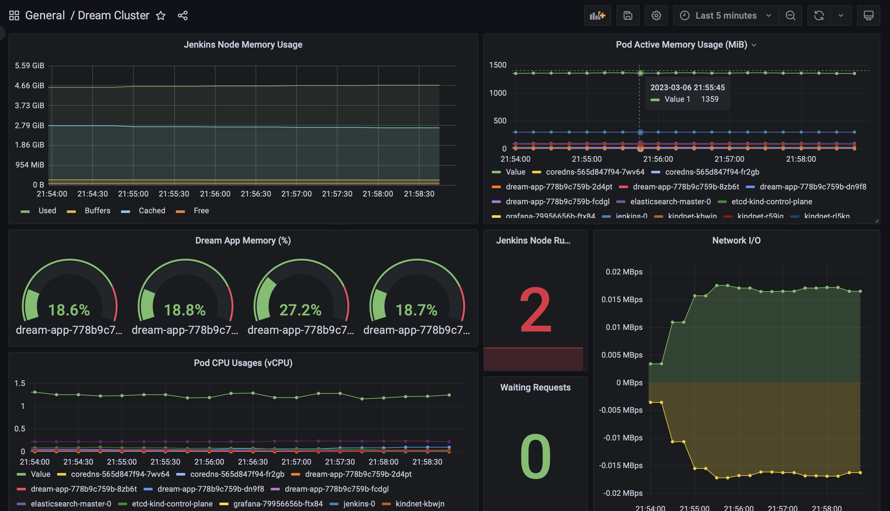

# DREAM CASE

### STEP 1

In that case used given `sample-java-app`. The image of the project has 2 stages: build and runtime. In the building stage maven is used. In the runtime stage created user for security reasons. Then install init process(`tini`) for prevent zombie process handling and the system run over that init process. Created image pushed to `aviatus/dream-app` on dockerhub.

### STEP 2

1. Create a Production Ready Kubernetes Cluster via Kubeadm, Kubespray etc.

Kubeadm is used for installation of kubernetes on three nodes. The three nodes created on AWS EC2. Ansible Playbooks are created for provide simplicity of the process. Containerd is picked for default container runtime interface. Docker installed on the third node for the jenkins docker build process. Control plane no schedule taint is removed. On the other hand, second node tainted with `role: jenkins` expression after creation of cluster.

2. Deploy Jenkins on K8s.

Applied `values.yaml` with `https://charts.jenkins.io/` helm repo which identifies tolerations and affinity rules. Also `role: jenkins` label applied to third node. The agents of jenkins mounted on node `docker.sock` file for docker build commands.

3. Deploy Elasticsearch on K8s for kubernetes & application logging purposes.

4. Deploy Prometheus & Grafana on K8s for kubernetes and application monitoring purposes.

For monitoring of the app `prometheus-community/prometheus` and `grafana/grafana` packets are used. Prometheus data source added to grafana and created a grafana dashboard.



https://snapshots.raintank.io/dashboard/snapshot/DgBzZvFuHupSaPUDRetbu3nRU42JojHZ

### STEP 3

1. Create the required kubernetes manifests (deployment, service, ingress, secret, hpa etc.)
2. Application should be running on both worker nodes with at least 4 pods and service will be balanced behind the nginx.
3. Make sure the application receives requests as soon as it is ready and restarted if there is a problem.
4. Create a build pipeline for the application via Jenkinsfile.

5. Create a deploy pipeline for the application via Jenkinsfile.
   Jenkins agent used with docker ansible image which is `quay.io/ansible/ansible-runner:stable-2.12-latest`. The one of the prequisites of pipeline is `ssh-agent` plugin for ssh key security reasons. The private ssh key is stored and used with jenkins credentials via `ssh-agent`. In that deployment system is created in a simple way. The deploy pipeline can be modified in many ways such as flexibility, simplicity and security. The ansible package can be updated as a more generic version for resources and namespaces. The another approach would be creating a certificate for kube api server and store it in jenkins credentials instead of ssh key thus run rollout command in the agent.

6. What would you do if you were to have canary deployments? Which tool would you use? How would you manage it through the pipeline? Please explain.

There are a few options for that purpose. Native CRD's can be used if the system has a service mesh such as Linkerd, Istio, and so on.

Example for Istio:

```sh
apiVersion: networking.istio.io/v1alpha3
kind: VirtualService
metadata:
name: helloworld
spec:
hosts: - helloworld
http:

- route:
  - destination:
    host: helloworld
    subset: v1
    weight: 90
  - destination:
    host: helloworld
    subset: v2
    weight: 10
```

If the system does not have a service mesh, the NGINX Ingress Controller can be used for that purpose. Such as `nginx.ingress.kubernetes.io/canary` and `nginx.ingress.kubernetes.io/canary-weight` annotations can be set in resources.

Both methods can be implemented with CI/CD tools for automation. A pipeline that specifies a different canary distribution at each stage with a manual confirmation check would be the appropriate approach.

For a Jenkins pipeline that uses `input`, confirmation can be added at each stage. In each phase, the pipeline should update the traffic distribution with annotations or CRD changes.

7. Write a custom validation webhook so that if a deployment does not have resource requests specified, it should fail.

The `cert-manager` used for validation webhook certification for kube api server communication. The validation webhook checks the deployment containers and rejects deployments where limits and request are not setted. Webhook docker image pushed to `aviatus/validating-webhook`.
